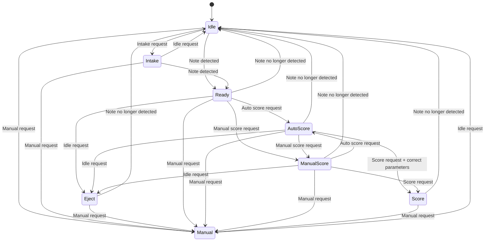

| **State**        | **Description**                                                                                             | **Transitions**                                                                                                                                                             |
|------------------|-------------------------------------------------------------------------------------------------------------|-----------------------------------------------------------------------------------------------------------------------------------------------------------------------------|
| **Idle**         | Do nothing                                                                                               | Intake request → **Intake**    Note detected → **Ready**    Manual request → **Manual**                                                                                 |
| **Intake**       | Intake a note                                                                                | Idle request → **Idle**    Note detected → **Ready**    Manual request → **Manual**                                                                                      |
| **Eject**        | Eject the note                                                                                     | Note no longer detected → **Idle**    Manual request → **Manual**                                                                                                         |
| **Ready**        | Note inside robot                                                                                           | Note no longer detected → **Idle**    Idle request → **Eject**    Auto score request → **Auto score**    Manual score request → **Manual score**    Manual request → **Manual**|
| **Auto score**   | Lock heading to target   Run flywheel if within range   May auto-align         | Note no longer detected → **Idle**    Idle request → **Eject**    Manual score request → **Manual score**    Score request and correct parameters → **Score**    Manual request → **Manual**   |
| **Manual score** | Manual control over shooter                                                                                 | Note no longer detected → **Idle**    Idle request → **Eject**    Auto score request → **Auto score**    Score request → **Score**    Manual request → **Manual**         |
| **Score**        | Shoot the note                                                                                       | Note no longer detected → **Idle**    Manual request → **Manual**                                                                                                         |
| **Manual**       | Manual control over robot                                                                                   | Exit manual request → **Ready**                                                                                                                                                       |

